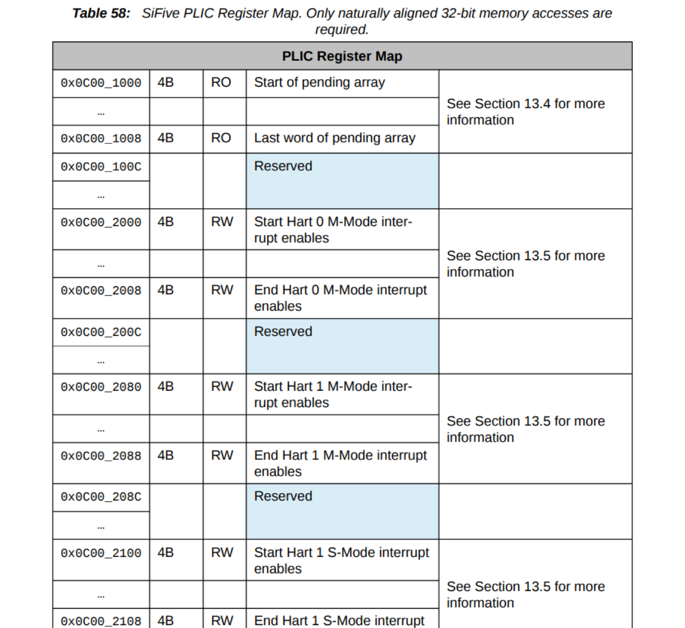

# 在U740上起zCore多核

本文档描述了在U740上起zCore多核的过程。

## 代码上的修改

将[zCore](https://github.com/rcore-os/zCore)clone到本地，参考[已有文档](./参考资料/doc.pdf)对其进行修改。也可以直接从[u740分支](https://github.com/OSLab-zCore/zCore/commits/u740)上拉下来我们已经修改好的为u740适配的版本。

以下在原文档的基础上做的一些修改：

1. 对编译image过程的一些修改

    首先将[u740的设备树文件](./资源文件/hifive-unmatched-a00.dtb)放到`zCore/target/riscv64/release`下。

    接着`zCore/target/riscv64/release`下新建its文件，用于打包FIT镜像。

    ```c++
    /*
     * U-Boot uImage source file for "zCore-FU740"
     */
     
    /dts-v1/;
     
    / {
        description = "U-Boot uImage source file for zCore-FU740";
        #address-cells = <1>;
     
        images {
            kernel {
                description = "Linux kernel for zCore-FU740";
                data = /incbin/("./zcore.bin.gz");
                type = "kernel";
                arch = "riscv";
                os = "linux";
                compression = "gzip";
                load = <0x80200000>;
                entry = <0x80200000>;
            };
            fdt {
                description = "Flattened Device Tree blob for zCoreFU740";
                data = /incbin/("./hifive-unmatched-a00.dtb");
                type = "flat_dt";
                arch = "riscv";
                compression = "none";
            };
        };
     
        configurations {
            default = "conf";
            conf {
                description = "Boot Linux kernel with FDT blob";
                kernel = "kernel";
                fdt = "fdt";
            };
        };
    };
    ```

    接着在[已有文档](./参考资料/doc.pdf)的基础上修改Makefile

    即，在最后一行加上`endif`，改一下`link_user_img`为`link-user-img`；下面还要多加一个make rule

    > 并添加对应编译feature：  
    >
    > ```makefile
    > # Makefile
    > ifeq ($(PLATFORM), fu740)
    > 	features += board_fu740 link-user-img
    > endif
    > # ...
    > fu740:
    > 	gzip -9 -cvf $(build_path)/zcore.bin > $(build_path)/zcore.bin.gz
    > 	mkimage -f $(build_path)/zcore-fu740.its $(build_path)/zcore-fu740.itb
    > 	@echo 'Build zcore fu740 FIT-uImage done'
    > ```

    注意：这时编译出来的是FIT镜像文件，而不是之前的uImage。

2. 目前不需要这个操作，SD卡的制作参考[这个文档](./制作SD卡流程.md)

   >在官网下载编译好的freedom-u-sdk，windows上可以用rufus将其装入SD卡中  

3. 最后一行加上一条命令

   >执行以下命令生成镜像 (在根目录下) 
   >
   >```bash
   >make riscv-image
   >cd zCore
   >make MODE=release LINUX=1 ARCH=riscv64 PLATFORM=fu740
   >make fu740 MODE=release LINUX=1 ARCH=riscv64 PLATFORM=fu740
   >```

4. 修改Cargo.toml

   在`zCore/Cargo.toml`中增加

   ```bash
   # Run on u740
   board_fu740 = []
   ```

5. 关于连接串口的操作

    波特率选择115200

6. 关于dtb中plic的解析

    原来的从dtb里找plic的逻辑不适用，因为u740的plic的tag比较独特。需要单独为其添加解析逻辑。具体的代码修改见[commit](https://github.com/OSLab-zCore/zCore/commit/e83600f39b0cdc03572cb09881d4a862c3426649)。

7. 关于内存映射的调整

    u740给了16个G的内存，但是zCore里给riscv留的地址空间不支持这么大。因此在建立页表的时候需要截断多余的内存，并且要把镜像里放dtb的位置单独留出来（我们的dtb是和镜像打包在一起的）。具体的代码修改见[commit](https://github.com/OSLab-zCore/zCore/commit/aad823267441d8eaae7ffbe450b7e1694e612e82)。

8. 关于timer的调整

    目前timer的有关处理是有bug的，但不知道为何在qemu上没问题，到了u740上就会显现出来。具体的代码修改见这个[commit](https://github.com/OSLab-zCore/zCore/commit/25b73d73407b1abb065bc7951a38f77bf822cf8b)和这个[commit](https://github.com/OSLab-zCore/zCore/commit/af152b62f791e6cd79af6f7521d8200af5777f30)。

9. 关于依赖的修改

    原zCore的两个依赖仓库（包括[kernel-sync](https://github.com/DeathWish5/kernel-sync)和[PreemptiveScheduler](https://github.com/DeathWish5/PreemptiveScheduler)）强行把cpu的数量写死了，这导致会在u740上产生冲突。目前已经打了patch，并且提交了pr，未来应该不存在这样的问题。

10. 关于cpu index

    u740的主核编号是1-4，需要从1号开始启动。但是zCore的逻辑是用0开始启动，这会导致起小核，进而产生问题（我们没有对小核进行特殊配置，也不打算使用）。因此我们需要单独为u740修改这部分的逻辑。具体代码修改见[commit](https://github.com/OSLab-zCore/zCore/commit/6b1d0d4624a8cc19f7a86749ff8aa31a2fb3fd49)。

11. 关于串口驱动

     原zCore缺少对U740串口输入的支持。我们参考[U740的datasheet](https://sifive.cdn.prismic.io/sifive/1a82e600-1f93-4f41-b2d8-86ed8b16acba_fu740-c000-manual-v1p6.pdf)编写了串口驱动。具体的实现参见这个[commit](https://github.com/OSLab-zCore/zCore/commit/494eb6249a266fd00e55e4ae9022ddde04ff3e94)。

12. 关于plic memory map的bug

     按照规范，plic的memory map应该是按照各个核的M态和S态（对应的内容）交替放置。但在U740中，小核没有S态，所以原本用于放小核（即0号核）的S态的位置放置了1号核的M态（对应的内容）。这导致后面所有的地址都往前移动了一个位置。我们看下图

     

     可以发现原本应该放0号核S态的位置没有空出来，后面所有的内容都往前挪了。这会造成zCore没有办法按照规范进行解析，进而无法正确打开中断。解决方案是用条件编译手动修改offset。具体代码修改见[commit](https://github.com/OSLab-zCore/zCore/commit/b6988ffd9b9016f3fa771e4261c8f67393d4763b)。

13. 更多细节修改

      请看[u740分支的commits](https://github.com/OSLab-zCore/zCore/commits/u740)。

## 通过网络起zCore多核

基本原理是通过一台主机搭建tftp服务，在板子上通过Uboot访问网络，从网络把主机中的镜像文件下载到内存，再从内存中boot。

首先在主机配置tftp服务，参考[CSDN上的教程](https://blog.csdn.net/weixin_45309916/article/details/109178659?utm_medium=distribute.pc_relevant.none-task-blog-2~default~baidujs_title~default-0.control&spm=1001.2101.3001.4242)。

接着开启板子，按任意键打断Uboot，进行一些基础配置（第一次启动需要，后面不需要）

```bash
# 第一次需要设置环境变量
=> dhcp # 获取自己的ip, 注意此时可能会自动下载服务器中的镜像, 请通过Ctrl+C打断
=> setenv ipaddr 192.168.50.3 # 这是上一步获得的ip
=> setenv serverip 192.168.50.95 # 服务器的ip
=> ping 192.168.50.95 # 可以试一下ping主机
=> saveenv # 保存配置到flash
# 之后可以直接跳到这里开始
# 下载镜像到内存
# 注意在最新版的zCore需要DTB 8对齐，但是在Image中DTB仅是4对齐
# 因此这里需要看情况选0xc0000000或0xc0000004
=> tftp 0xc0000000 zcore-fu740.itb
=> bootm 0xc0000000 # 启动
```

## 未来拓展

目前zCore已经针对U740适配得非常好了，基本上已经没有不稳定的情况。下一步的扩展主要是针对代码通用性的优化，包括

- 目前我们针对U740的一些适配都是通过条件编译实现的（而且比较碎片化，基本上是哪里有bug就在哪里用条件编译打补丁），有些地方可能写得比较“hard code”。未来可以考虑用更加具有通用性的写法，比如将U740的特性集中到一个文件，然后设置全局开关。
- 在适配U740的过程中，我们修复了一些本身zCore存在的bug以及依赖库的bug，但这些修复还没有完全应用到主线，以及依赖库的bug可能还有更加优雅的写法。
- zCore提供的可用内存包括0x80000000 - 0x480000000。但为了适配zCore当前的BitAllocator的设定（最大不超过2G），我们只使用了其中的0x80000000 - 0xFFFFF000。未来可以考虑将其扩展为0x80000000 - 0x480000000。可能的修改包括
  - 使用更大的BitAllocator。
  - 修改`KERNEL_OFFSET`，位置在[const.rs](https://github.com/OSLab-zCore/zCore/blob/u740/zCore/src/platform/riscv/consts.rs)。（即去掉开头的几个F，换成0）
  - 修改其他潜在的不兼容的地方，参考x86的实现。
