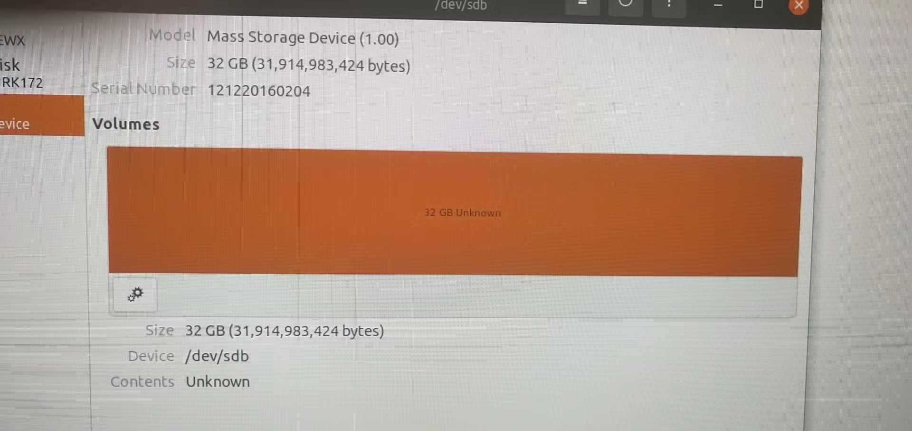
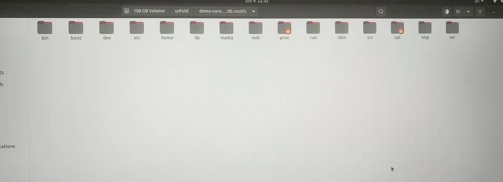

# 制作U740启动用的SD卡

下面记录我们尝试的几种制作sd卡的方法。

## 直接使用官网的镜像（失败）

具体而言，直接从[官网release](https://github.com/sifive/freedom-u-sdk/releases)中下载[demo-coreip-cli-unmatched-2022.03.00.rootfs.tar.xz](https://github.com/sifive/freedom-u-sdk/releases/download/2022.03.00/demo-coreip-cli-unmatched-2022.03.00.rootfs.tar.xz)，然后将其dd到sd卡。

dd的命令不要指定sd卡的分区（即`dd of=/dev/sdbX`），而是整个覆盖（即`dd of=/dev/sdb`）。

拷贝完后发现sd卡并不能被电脑识别出来。



询问了老师后，我们先`tar -xvf xxx.tar.xz`，查看解压出来的东西



发现解压出来的是完整的linux文件目录。我们猜测rootfs后缀的镜像应该是错误的，遂尝试手动build镜像。

## 按照官网的README手动build镜像（失败）

直接按照[官网README](https://github.com/sifive/freedom-u-sdk)手动build即可。以下是几个需要注意的点

1. repo工具无法安装

   repo工具的默认源是谷歌源，可能无法连得上（有VPN也连不上，很奇怪）。解决方法是使用清华源，可以参考以下两篇博客

   - https://blog.csdn.net/zy13608089849/article/details/84767864
   - https://blog.csdn.net/feiniao8651/article/details/59178128?spm=1001.2101.3001.6650.1&utm_medium=distribute.pc_relevant.none-task-blog-2%7Edefault%7ECTRLIST%7ERate-1-59178128-blog-84767864.pc_relevant_antiscanv2&depth_1-utm_source=distribute.pc_relevant.none-task-blog-2%7Edefault%7ECTRLIST%7ERate-1-59178128-blog-84767864.pc_relevant_antiscanv2

   其中关键的命令是设置REPO的默认URL

   ```bash
   export REPO_URL='https://mirrors.tuna.tsinghua.edu.cn/git/git-repo'
   ```

2. `setup.sh`运行失败

   第一次如下运行`setup.sh`可能会失败

   >### Setting up Build Environment
   >
   >This step has to be done after you modify your environment with toolchain you want to use otherwise wrong host tools might be available in the package build environment. For example, `gcc` from host system will be used for building `*-native` packages.
   >
   >```
   >. ./freedom-u-sdk/setup.sh
   >```

   提示要需要安装几个软件包

   ```log
   NOTE: Starting bitbake server...
   ERROR: The following required tools (as specified by HOSTTOOLS) appear to be unavailable in PATH, please install them in order to proceed:
     chrpath diffstat pzstd zstd
   ERROR: The following required tools (as specified by HOSTTOOLS) appear to be unavailable in PATH, please install them in order to proceed:
     chrpath diffstat pzstd zstd
   ```

   按照提示安装即可，注意`pzstd`不需要安装。

   安装完成后，**记得删除**`build`目录，再运行一次`setup.sh`，否则接下来可能会缺少`MACHINE`的选项。

   最后没安装成功，原因是电脑磁盘不够，这个build貌似需要$<200\mathrm{\ GiB}$。

## 通过Ubuntu提供的镜像（成功）

通过下列链接下载u740 Ubuntu镜像

http://cdimage.ubuntu.com/releases/21.10/release/

直接将镜像dd到sd卡中，注意不要指定sd卡的分区（即`dd of=/dev/sdbX`），而是整个覆盖（即`dd of=/dev/sdb`）。

