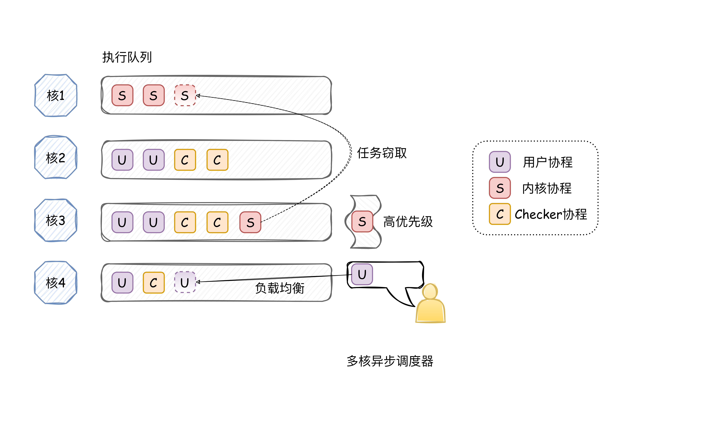

# 多核异步调度器设计文档

## 多核异步调度器

详见[仓库](https://github.com/OSLab-zCore/PreemptiveScheduler/tree/yuzc)。

### 整体框架



### 功能概述

异步调度器的设计初衷是适配异步 syscall，以提升内核调度和用户执行的效率。具体而言，每个用户线程，都会在内核中对应一个始终处于可运行态但优先级最低的 checker 协程，该协程每次执行都会检查 Submit Queue 中头尾的一致性，并在不一致时产生新协程处理新提交的 syscall 请求。用户程序同样需要轮询 Complete Queue 来检查 syscall 是否执行结束。

对延迟敏感的用户，异步 syscall 可能不满足其要求，用户可以使用普通的同步 syscall，也可以使用高优先级的异步 syscall，当内核调度识别到高优先级 syscall 后，发生中断会将正在执行的协程退化为线程（因为一个协程的退出至少需要等到下一个退出点），新创建一个线程并立即执行高优先级事件，处理完毕之后回归到之前协程的执行。

由上可知，本调度器的调度对象包括内核协程（处理系统调用产生的协程）、checker 协程和另一类为封装成协程的用户线程。涉及内核协程的切换开销较小，耗时短，而设计用户协程的切换开销较大，耗时长，由于本调度器的多核的**任务窃取机制**（如果当前核没有任务可跑，则会从其他核的 `task_collection` 中窃取）和**负载均衡机制**（在任务 `spawn` 的时候，会选取负载最轻的那个核），执行速度快的内核协程，会被倾向于集中在某个核上，context switch 尽管次数多，但开销较小。而对于其余跑用户程序的核，由于异步系统调用，用户程序只会在时间片耗尽时才会切换到其他进程，切换次数很少。综上所述，这样实现切换开销都比较低。

### 关键结构

首先是一个核对应一个的 `ExecutorRuntime`：

```rust
pub struct ExecutorRuntime {
    // runtime only run on this cpu
    cpu_id: u8,

    // 只会在一个 core 上运行，不需要考虑同步问题
    task_collection: Arc<TaskCollection>,

    // 通过 force_switch_future 会将 strong_executor 降级为 weak_executor
    strong_executor: Arc<Pin<Box<Executor>>>,

    // 该 executor 在执行完一次后就会被 drop
    weak_executors: Vec<Option<Arc<Pin<Box<Executor>>>>>,

    // 当前正在执行的 executor
    current_executor: Option<Arc<Pin<Box<Executor>>>>,

    // runtime context, WARN: riscv and x86_64 use different struct
    context: Context,
}
```

然后是内部的 `Executor`：

```rust
pub struct Executor {
    // 编号
    id: usize,
    // 任务集合
    task_collection: Arc<TaskCollection>,
  	// 上下文切换相关
    stack_base: usize,
    pub context: ExecuterContext,
    #[cfg(target_arch = "riscv64")]
    context_data: ContextData,
    task_id: usize,
    state: ExecutorState,
}
```

任务集合 `TaskCollection`：

```rust
pub struct TaskCollection {
    future_collections: Vec<Mutex<FutureCollection>>,
    task_num: AtomicUsize,
    generator: Option<Mutex<Pin<Box<dyn Generator<Yield = Option<Key>, Return = ()>>>>>,
}
```

`FutureCollection` 就是正常的由 `Future`、执行状态以及 `Waker` 组成的集合。关于 `Waker` 的数据结构，经过权衡选取了不保序的 bitmap。测试过对 FIFO 队列然后每次中断降低当前时间片执行完毕任务的优先级，但在性能测例上表现有所下降，究其原因在于保序需要对相关数据结构加锁，加锁的开销比保序可能取得的收益要高。

## 相关测例说明

详见用户库 [zcore-user](https://github.com/OSLab-zCore/zcore-user)，包含编写好的多核调度测例 coretest、集成测例 libctest 和适配在 zCore 上的 lmbench。
